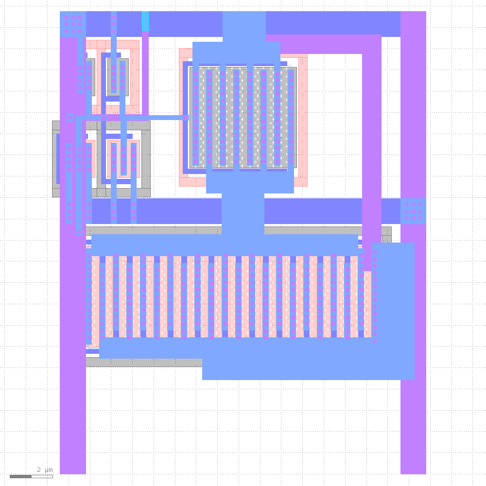
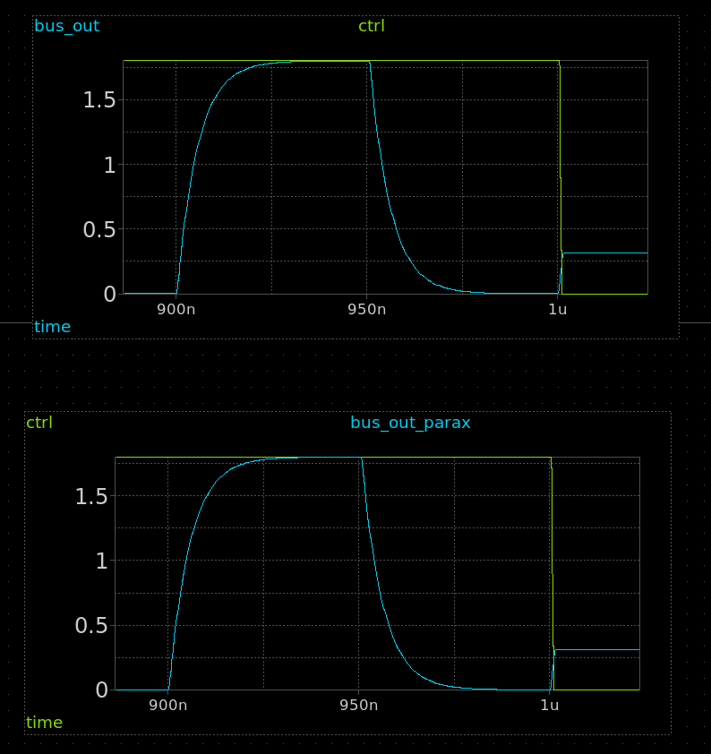
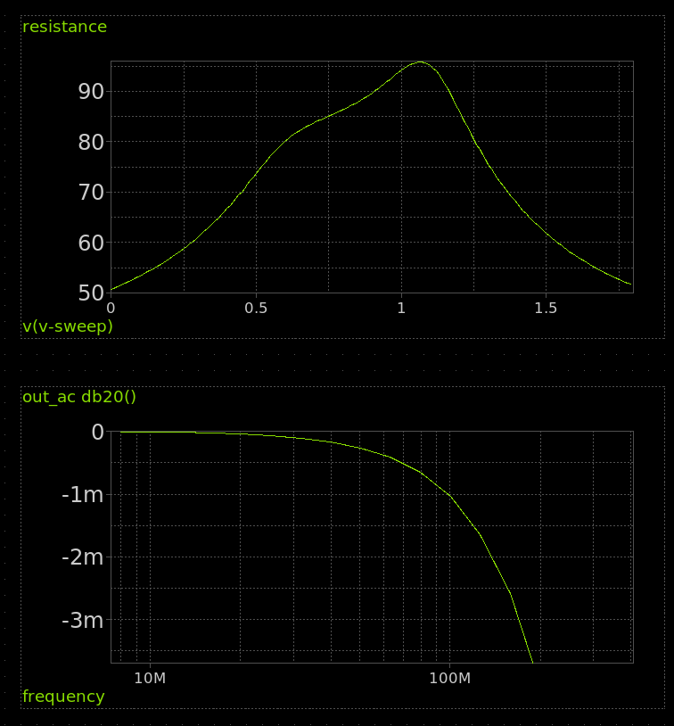

# Analog switch for TT06

[schematic](https://xschem-viewer.com/?file=https://github.com/TinyTapeout/tt-multiplexer/blob/main/tt_asw_1v8/xschem/tt_asw_1v8.sch)

# Layout

# Simulations

## Schematic vs Layout

## Resistance and AC

# Log

## Sun  7 Apr 16:42:22 CEST 2024

* Found a xschem bug where the xschem generated spice wasn't correct with LVS mode on, layout wasn't correct but was passing LVS
* Sylvain updated schematic to avoid the `_nf` variant MOSFETs, redid layout with the new (bigger) transistors
* Fixed the spice netlist by hand and now layout simulation is as before.

## 6th April 2024

* Improved schematic and layout by Sylvain. Resolved issue #1.
* Changed the resistance and AC sim to use the extracted circuit
* Layout's simulation of the new layout is 10x worse on resistance

## 4th April 2024

* Add testbench for transient and AC.

## 21st March 2024

* Initial spec from Harald, schematic and first layout.
