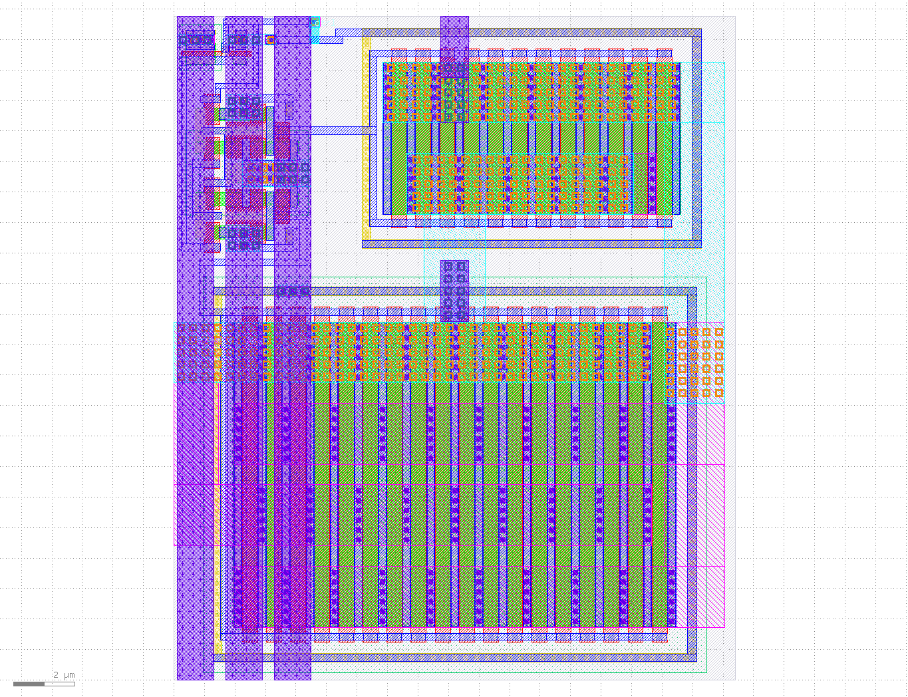
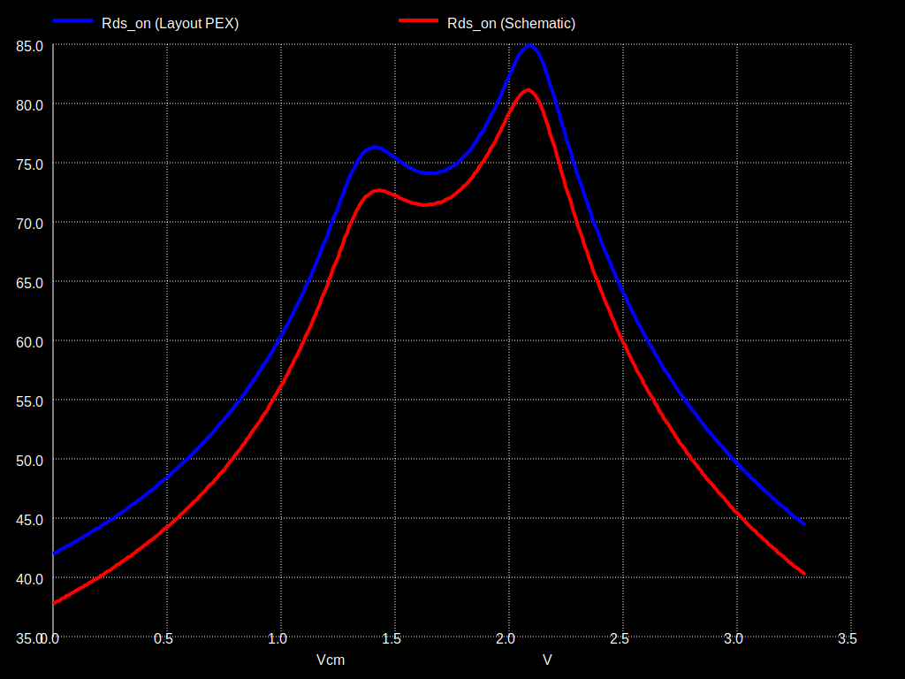
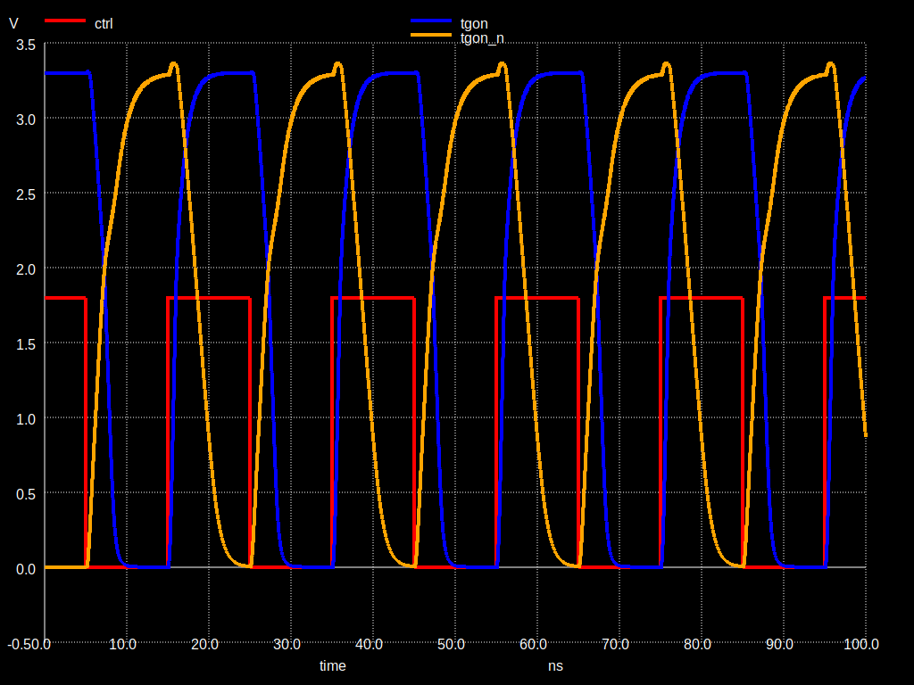

# 3V3/5V tolerant analog switch for TT07+

[schematic](https://xschem-viewer.com/?file=https://github.com/TinyTapeout/tt-multiplexer/blob/main/asw/tt_asw_3v3/xschem/tt_asw_3v3.sch)

# Layout

# Simulations

## Rds\_on (Schematic vs Layout)

## Level converter dynamic behavior

