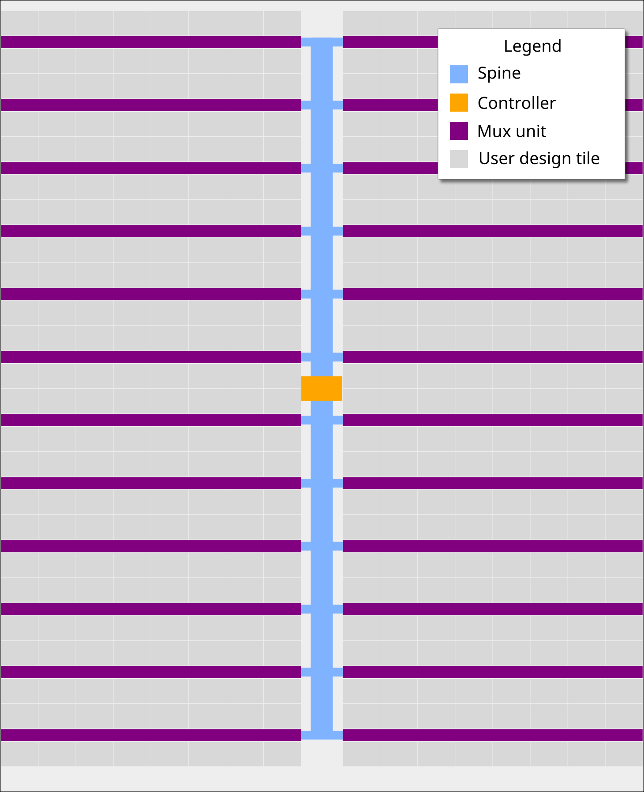
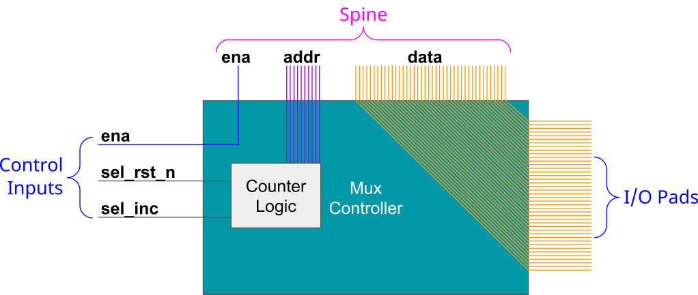
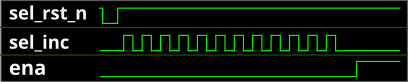

# The Tiny Tapeout Multiplexer

## Overview

The Tiny Tapeout Multiplexer distributes a single set of user IOs to multiple user designs. It is the backbone of the Tiny Tapeout chip.

It has the following features:

- 10 dedicated inputs
- 8 dedicated outputs
- 8 bidirectional IOs
- Supports up to 512 user designs (32 mux units, each with up to 16 designs)
- Designs can have different sizes. The basic unit is a called a tile, and each design can occupy up to 16 tiles.

## Operation

The multiplexer consists of three main units:

1. The controller - used to set the address of the active design
2. The spine - a bus that connects the controller with all the mux units
3. Mux units - connect the spine to individual user designs

### The Controller

The mux controller has 3 inputs lines:

| Input       | Description                                           |
| ----------- | ----------------------------------------------------- |
| `ena`       | Sent as-is (buffered) to the downstream mux units     |
| `sel_rst_n` | Resets the internal address counter to 0 (active low) |
| `sel_inc`   | Increments the internal address counter by 1          |

It outputs the address of the currently selected design on the `si_sel` port of the spine (see below).

For instance, to select the design at address 12, you need to pulse `sel_rst_n` low, and then pulse `sel_inc` 12 times:

Internally, the controller is just a chain of 10 D flip-flops. The `sel_inc` signal is connected to the clock of the first flip-flop, and the output of each flip-flop is connected to the clock of the next flip-flop. The `sel_rst_n` signal is connected to the reset of all flip-flops.

The following Wokwi projects demonstrates this setup: https://wokwi.com/projects/364347807664031745. It contains an Arduino Nano that decodes the currently selected mux address and displays it on a 7-segment display. Click on the button labeled `RST_N` to reset the counter, and click on the button labeled `INC` to increment the counter.

### The Spine

The controller and all the muxes are connected together through the spine. The spine has the following signals going on it:

From controller to mux:

- `si_ena` - the `ena` input
- `si_sel` - selected design address (10 bits)
- `ui_in` - user clock, user `rst_n`, user inputs (10 bits)
- `uio_in` - bidirectional I/O inputs (8 bits)

From mux to controller:

- `uo_out` - User outputs (8 bits)
- `uio_oe` - Bidirectional I/O output enable (8 bits)
- `uio_out` - Bidirectional I/O outputs (8 bits)

The only signal which is actually generated by the controller is `si_sel` (using `sel_rst_n` and `sel_inc`, as explained above).
The other signals are just going through from/to the chip IO pads.

### The Multiplexer (The Mux)

Each mux branch is connected to up to 16 designs. It also has 5 bits of hard-coded address (each unit gets assigned a different address, based on its position on the die).

The mux implements the following logic:

If `si_ena` is 1, and `si_sel` matches the mux address, we know the mux is active. Then, it activates the specific user design port that matches the remaining bits of `si_sel`.

For the active design:

- `clk`, `rst_n`, `ui_in`, `uio_in` are connected to the respective pins coming from the spine (through a buffer)
- `uo_out`, `uio_oe`, `uio_out` are connected to the respective pins going out to the spine (through a tristate buffer)

For all others, inactive designs (including all designs in inactive muxes):

- `clk`, `rst_n`, `ui_in`, `uio_in` are all tied to zero
- `uo_out`, `uio_oe`, `uio_out` are disconnected from the spine (the tristate buffer output enable is disabled)

## Pinout

### SKY130 Open Frame chips

| QFN64 pin | mprj_io pin | Function      | Signal         |
|-----------|-------------|---------------|----------------|
| 1         | vssa2       | Ground        | GND            |
| 2         | 25          | Output        | uo[1]          |
| 3         | 26          | Output        | uo[2]          |
| 4         | 27          | Output        | uo[3]          |
| 5         | 28          | Output        | uo[4]          |
| 6         | 29          | Output        | uo[5]          |
| 7         | 30          | Output        | uo[6]          |
| 8         | 31          | Output        | uo[7]          |
| 9         | vdda2       | Power         | VDD Analog     |
| 10        | vssd2       | Ground        | GND            |
| 11        | 32          | Analog        | analog[6]      |
| 12        | 33          | Analog        | analog[7]      |
| 13        | 34          | Analog        | analog[8]      |
| 14        | 35          | Analog        | analog[9]      |
| 15        | 36          | Analog        | analog[10]     |
| 16        | 37          | Analog        | analog[11]     |
| 17        | vddio       | Power         | VDD IO         |
| 18        | vccd        | Power         | VDD Core       |
| 19        | NC          | /             | /              |
| 20        | vssa        | Ground        | GND            |
| 21        | resetb      | /             | /              |
| 22        | 38          | Mux Control   | ctrl_ena       |
| 23        | vssd        | Ground        | GND            |
| 24        | 39          | Mux Control   | ctrl_sel_inc   |
| 25        | 40          | Mux Control   | ctrl_sel_rst_n |
| 26        | 41          | Reserved      | (none)         |
| 27        | 42          | Reserved      | (none)         |
| 28        | 43          | Reserved      | (none)         |
| 29        | vssio       | Ground        | GND            |
| 30        | vdda        | Power         | VDD Analog     |
| 31        | 0           | Input         | ui[0]          |
| 32        | 1           | Input         | ui[1]          |
| 33        | 2           | Input         | ui[2]          |
| 34        | 3           | Input         | ui[3]          |
| 35        | 4           | Input         | ui[4]          |
| 36        | 5           | Input         | ui[5]          |
| 37        | 6           | Input         | ui[6]          |
| 38        | vssa1       | Ground        | GND            |
| 39        | vssd1       | Ground        | GND            |
| 40        | vdda1       | Power         | VDD Analog     |
| 41        | 7           | Analog        | analog[0]      |
| 42        | 8           | Analog        | analog[1]      |
| 43        | 9           | Analog        | analog[2]      |
| 44        | 10          | Analog        | analog[3]      |
| 45        | 11          | Analog        | analog[4]      |
| 46        | 12          | Analog        | analog[5]      |
| 47        | vdda1       | Power         | VDD Analog     |
| 48        | 13          | Input         | ui[7]          |
| 49        | vccd1       | Power         | VDD Core       |
| 50        | 14          | Input         | u_clk †        |
| 51        | 15          | Input         | u_rst_n †      |
| 52        | vssa1       | Ground        | GND            |
| 53        | 16          | Bidirectional | uio[0]         |
| 54        | 17          | Bidirectional | uio[1]         |
| 55        | 18          | Bidirectional | uio[2]         |
| 56        | vssio       | Ground        | GND            |
| 57        | 19          | Bidirectional | uio[3]         |
| 58        | 20          | Bidirectional | uio[4]         |
| 59        | 21          | Bidirectional | uio[5]         |
| 60        | 22          | Bidirectional | uio[6]         |
| 61        | 23          | Bidirectional | uio[7]         |
| 62        | 24          | Output        | uo[0]          |
| 63        | vccd2       | Power         | VDD Core       |
| 64        | vddio       | Power         | VDD IO         |
| EPAD      |             | Ground        |                |

### IHP SG13G2 custom pad frame

| Die Pad | QFN64 pin | Function      | Signal         |
|---------|-----------|---------------|----------------|
| 0       | 1         | Mux Control   | ctrl_ena       |
| 1       | 2         | Mux Control   | ctrl_sel_inc   |
| 2       | 3         | Mux Control   | ctrl_sel_rst_n |
| 3       | 4         | Reserved      | (none)         |
| 4       | 5         | Reserved      | (none)         |
| 5       | 6         | Reserved      | (none)         |
| 6       | 7         | Reserved      | (none)         |
| 7       | 8         | Reserved      | (none)         |
| 8       | 9         | Output        | uo[0]          |
| 9       | 10        | Output        | uo[1]          |
| 10      | 11        | Output        | uo[2]          |
| 11      | 12        | Output        | uo[3]          |
| 12      | 13        | Output        | uo[4]          |
| 13      | 14        | Output        | uo[5]          |
| 14      | 15        | Output        | uo[6]          |
| 15      | 16        | Output        | uo[7]          |
| 16      | 17        | Power         | VDD IO         |
| 17      | 18        | Ground        | GND IO         |
| 18      | 19        | Analog        | analog[0]      |
| 19      | 20        | Analog        | analog[1]      |
| 20      | 21        | Analog        | analog[2]      |
| 21      | 22        | Analog        | analog[3]      |
| 22      | 23        | Power         | VDD Analog     |
| 23      | 24        | Ground        | GND Analog     |
| 24      | 25        | Analog        | analog[4]      |
| 25      | 26        | Analog        | analog[5]      |
| 26      | 27        | Analog        | analog[6]      |
| 27      | 28        | Analog        | analog[7]      |
| 28      | 29        | Ground        | GND Core       |
| 29      | 30        | Power         | VDD Core       |
| 30      | 31        | Ground        | GND IO         |
| 31      | 32        | Power         | VDD IO         |
| 32      | 33        | Bidirectional | uio[0]         |
| 33      | 34        | Bidirectional | uio[1]         |
| 34      | 35        | Bidirectional | uio[2]         |
| 35      | 36        | Bidirectional | uio[3]         |
| 36      | 37        | Bidirectional | uio[4]         |
| 37      | 38        | Bidirectional | uio[5]         |
| 38      | 39        | Bidirectional | uio[6]         |
| 39      | 40        | Bidirectional | uio[7]         |
| 40      | 41        | Input         | ui[0]          |
| 41      | 42        | Input         | ui[1]          |
| 42      | 43        | Input         | ui[2]          |
| 43      | 44        | Input         | ui[3]          |
| 44      | 45        | Input         | ui[4]          |
| 45      | 46        | Input         | ui[5]          |
| 46      | 47        | Input         | ui[6]          |
| 47      | 48        | Input         | ui[7]          |
| 48      | 49        | Input         | u_rst_n †      |
| 49      | 50        | Input         | u_clk †        |
| 50      | 51        | Ground        | GND IO         |
| 51      | 52        | Power         | VDD IO         |
| 52      | 53        | Analog        | analog[8]      |
| 53      | 54        | Analog        | analog[9]      |
| 54      | 55        | Analog        | analog[10]     |
| 55      | 56        | Analog        | analog[11]     |
| 56      | 57        | Ground        | GND Analog     |
| 57      | 58        | Power         | VDD Analog     |
| 58      | 59        | Analog        | analog[12]     |
| 59      | 60        | Analog        | analog[13]     |
| 60      | 61        | Analog        | analog[14]     |
| 61      | 62        | Analog        | analog[15]     |
| 62      | 63        | Ground        | GND Core       |
| 63      | 64        | Power         | VDD Core       |
| SUB     | EPAD      | Ground        |                |

### GF180mcuD custom pad frame

| Die Pad | QFN64 pin | Function      | Signal         |
|---------|-----------|---------------|----------------|
| 0       | 1         | Mux Control   | ctrl_ena       |
| 1       | 2         | Mux Control   | ctrl_sel_inc   |
| 2       | 3         | Mux Control   | ctrl_sel_rst_n |
| 3       | 4         | Reserved      | (none)         |
| 4       | 5         | Reserved      | (none)         |
| 5       | 6         | Reserved      | (none)         |
| 6       | 7         | Reserved      | (none)         |
| 7       | 8         | Reserved      | (none)         |
| 8       | EPAD      | Ground        | GND IO         |
| 9       | 9         | Output        | uo[0]          |
| 10      | 10        | Output        | uo[1]          |
| 11      | 11        | Output        | uo[2]          |
| 12      | 12        | Output        | uo[3]          |
| 13      | 13        | Output        | uo[4]          |
| 14      | 14        | Output        | uo[5]          |
| 15      | 15        | Output        | uo[6]          |
| 16      | 16        | Output        | uo[7]          |
| 17      | 17        | Power         | VDD IO         |
| 18      | EPAD      | Ground        | GND IO         |
| 19      | 18        | Analog        | analog[0]      |
| 20      | 19        | Analog        | analog[1]      |
| 21      | 20        | Analog        | analog[2]      |
| 22      | 21        | Analog        | analog[3]      |
| 23      | 22        | Analog        | analog[4]      |
| 24      | 23        | Analog        | analog[5]      |
| 25      | 24        | Power         | PWR Analog     |
| 26      | EPAD      | Ground        | GND Analog     |
| 27      | 25        | Analog        | analog[6]      |
| 28      | 26        | Analog        | analog[7]      |
| 29      | 27        | Analog        | analog[8]      |
| 30      | 28        | Analog        | analog[9]      |
| 31      | 29        | Analog        | analog[10]     |
| 32      | 30        | Analog        | analog[11]     |
| 33      | EPAD      | Ground        | GND Core       |
| 34      | 31        | Power         | VDD Core       |
| 35      | EPAD      | Ground        | GND IO         |
| 36      | 32        | Power         | VDD IO         |
| 37      | 33        | Bidirectional | uio[0]         |
| 38      | 34        | Bidirectional | uio[1]         |
| 39      | 35        | Bidirectional | uio[2]         |
| 40      | 36        | Bidirectional | uio[3]         |
| 41      | 37        | Bidirectional | uio[4]         |
| 42      | 38        | Bidirectional | uio[5]         |
| 43      | 39        | Bidirectional | uio[6]         |
| 44      | 40        | Bidirectional | uio[7]         |
| 45      | EPAD      | Ground        | GND IO         |
| 46      | 41        | Input         | ui[0]          |
| 47      | 42        | Input         | ui[1]          |
| 48      | 43        | Input         | ui[2]          |
| 49      | 44        | Input         | ui[3]          |
| 50      | 45        | Input         | ui[4]          |
| 51      | 46        | Input         | ui[5]          |
| 52      | 47        | Input         | ui[6]          |
| 53      | 48        | Input         | ui[7]          |
| 54      | 49        | Input         | u_rst_n †      |
| 55      | 50        | Input         | u_clk †        |
| 56      | EPAD      | Ground        | GND IO         |
| 57      | 51        | Power         | VDD IO         |
| 58      | 52        | Analog        | analog[12]     |
| 59      | 53        | Analog        | analog[13]     |
| 60      | 54        | Analog        | analog[14]     |
| 61      | 55        | Analog        | analog[15]     |
| 62      | EPAD      | Ground        | GND Analog     |
| 63      | 56        | Power         | PWR Analog     |
| 64      | 57        | Analog        | analog[16]     |
| 65      | 58        | Analog        | analog[17]     |
| 66      | 59        | Analog        | analog[18]     |
| 67      | 60        | Analog        | analog[19]     |
| 68      | 61        | Analog        | analog[20]     |
| 69      | 62        | Analog        | analog[21]     |
| 70      | EPAD      | Ground        | GND Core       |
| 71      | 63        | Power         | VDD Core       |
| 72      | EPAD      | Ground        | GND IO         |
| 73      | 64        | Power         | VDD IO         |

### Notes

† Internally, there's no difference between `u_clk`, `u_rst_n`, and `ui` pins. They are all just bits in the `pad_ui_in` bus. However, we use different names to make it easier to understand the purpose of each signal.
