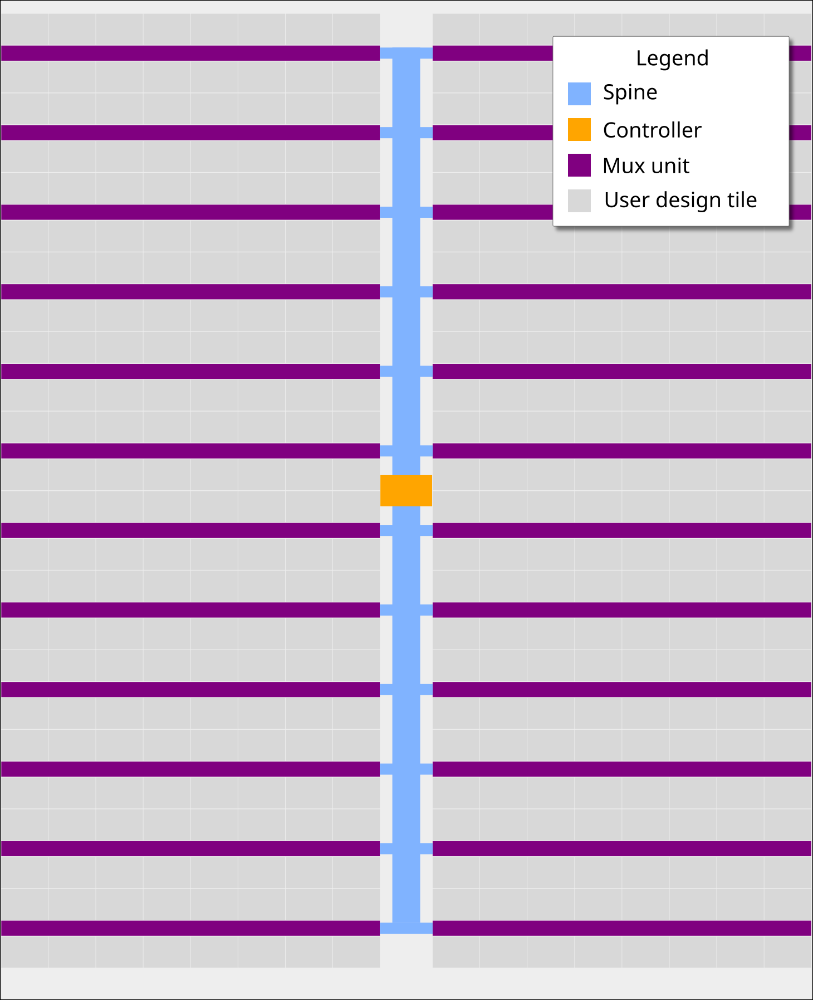

# The Tiny Tapeout Multiplexer

## Overview

The Tiny Tapeout Multiplexer distributes a single set of user IOs to multiple user designs. It is the backbone of the Tiny Tapeout chip.

It has the following features:

- 10 dedicated inputs
- 8 dedicated outputs
- 8 bidirectional IOs
- Supports up to 512 user designs (32 mux units, each with up to 16 designs)
- Designs can have different sizes. The basic unit is a called a tile, and each design can occupy up to 16 tiles.

## Operation

The multiplexer consists of three main units:

1. The controller - used to set the address of the active design
2. The spine - a bus that connects the controller with all the mux units
3. Mux units - connect the spine to individual user designs

### The Controller

The mux controller has 3 inputs lines:

| Input       | Description                                           |
| ----------- | ----------------------------------------------------- |
| `ena`       | Sent as-is (buffered) to the downstream mux units     |
| `sel_rst_n` | Resets the internal address counter to 0 (active low) |
| `sel_inc`   | Increments the internal address counter by 1          |

It outputs the address of the currently selected design on the `si_sel` port of the spine (see below).

For instance, to select the design at address 12, you need to pulse `sel_rst_n` low, and then pulse `sel_inc` 12 times:

Internally, the controller is just a chain of 10 D flip-flops. The `sel_inc` signal is connected to the clock of the first flip-flop, and the output of each flip-flop is connected to the clock of the next flip-flop. The `sel_rst_n` signal is connected to the reset of all flip-flops.

The following Wokwi projects demonstrates this setup: https://wokwi.com/projects/364347807664031745. It contains an Arduino Nano that decodes the currently selected mux address and displays it on a 7-segment display. Click on the button labeled `RST_N` to reset the counter, and click on the button labeled `INC` to increment the counter.

### The Spine

The controller and all the muxes are connected together through the spine. The spine has the following signals going on it:

From controller to mux:

- `si_ena` - the `ena` input
- `si_sel` - selected design address (10 bits)
- `ui_in` - user clock, user `rst_n`, user inputs (10 bits)
- `uio_in` - bidirectional I/O inputs (8 bits)

From mux to controller:

- `uo_out` - User outputs (8 bits)
- `uio_oe` - Bidirectional I/O output enable (8 bits)
- `uio_out` - Bidirectional I/O outputs (8 bits)

The only signal which is actually generated by the controller is `si_sel` (using `sel_rst_n` and `sel_inc`, as explained above).
The other signals are just going through from/to the chip IO pads.

### The Multiplexer (The Mux)

Each mux branch is connected to up to 16 designs. It also has 5 bits of hard-coded address (each unit gets assigned a different address, based on its position on the die).

The mux implements the following logic:

If `si_ena` is 1, and `si_sel` matches the mux address, we know the mux is active. Then, it activates the specific user design port that matches the remaining bits of `si_sel`.

For the active design:

- `clk`, `rst_n`, `ui_in`, `uio_in` are connected to the respective pins coming from the spine (through a buffer)
- `uo_out`, `uio_oe`, `uio_out` are connected to the respective pins going out to the spine (through a tristate buffer)

For all others, inactive designs (including all designs in inactive muxes):

- `clk`, `rst_n`, `ui_in`, `uio_in` are all tied to zero
- `uo_out`, `uio_oe`, `uio_out` are disconnected from the spine (the tristate buffer output enable is disabled)

## Pinout

| mprj_io pin | Function      | Signal     | QFN64 pin |
| ----------- | ------------- | ---------- | --------- |
| 0           | Analog        | analogB[0] | 31        |
| 1           | Analog        | analogB[1] | 32        |
| 2           | Analog        | analogB[2] | 33        |
| 3           | Analog        | analogB[3] | 34        |
| 4           | Output        | uo_out[0]  | 35        |
| 5           | Output        | uo_out[1]  | 36        |
| 6           | Output        | uo_out[2]  | 37        |
| 7           | Output        | uo_out[3]  | 41        |
| 8           | Output        | uo_out[4]  | 42        |
| 9           | Output        | uo_out[5]  | 43        |
| 10          | Output        | uo_out[6]  | 44        |
| 11          | Output        | uo_out[7]  | 45        |
| 12          | Analog        | analogA[0] | 46        |
| 13          | Analog        | analogA[1] | 48        |
| 14          | Analog        | analogA[2] | 50        |
| 15          | Bidirectional | uio[0]     | 51        |
| 16          | Bidirectional | uio[1]     | 53        |
| 17          | Bidirectional | uio[2]     | 54        |
| 18          | Bidirectional | uio[3]     | 55        |
| 19          | Bidirectional | uio[4]     | 57        |
| 20          | Bidirectional | uio[5]     | 58        |
| 21          | Bidirectional | uio[6]     | 59        |
| 22          | Bidirectional | uio[7]     | 60        |
| 23          | Analog        | analogA[3] | 61        |
| 24          | Analog        | analogA[4] | 62        |
| 25          | Analog        | analogA[5] | 2         |
| 26          | Input         | clk        | 3         |
| 27          | Input         | rst_n      | 4         |
| 28          | Input         | ui_in[0] † | 5         |
| 29          | Input         | ui_in[1]   | 6         |
| 30          | Input         | ui_in[2]   | 7         |
| 31          | Input         | ui_in[3]   | 8         |
| 32          | Input         | ui_in[4]   | 11        |
| 33          | Input         | ui_in[5]   | 12        |
| 34          | Input         | ui_in[6]   | 13        |
| 35          | Input         | ui_in[7]   | 14        |
| 36          | Analog        | analogB[4] | 15        |
| 37          | Analog        | analogB[5] | 16        |
| 38          | Mux Control   | TBD        | 22        |
| 39          | Mux Control   | TBD        | 24        |
| 40          | Mux Control   | TBD        | 25        |
| 41          | Mux Control   | TBD        | 26        |
| 42          | Mux Control   | TBD        | 27        |
| 43          | Mux Control   | TBD        | 28        |

† Internally, there's no difference between `clk`, `rst_n`, and `ui_in` pins. They are all just bits in the `pad_ui_in` bus. However, we use different names to make it easier to understand the purpose of each signal.
